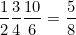

## Task
Given a list of rational numbers,find their product.  

**Input Format**

First line contains ***n***, the number of rational numbers.  
The ***i<sup>th</sup>*** of next ***n*** lines contain two integers each, the numerator( **N<sub>i</sub>** ) and denominator( **N<sub>i</sub>** ) of the  rational number in the list.  

**Output Format**

Print only one line containing the numerator and denominator of the product of the numbers in the list in its simplest form, i.e. numerator and denominator have no common divisor other than **1**.  

**Sample Input**
```
3
1 2
3 4
10 6
```
**Sample Output**
```
5 8
```
**Explanation   **

Required product is 